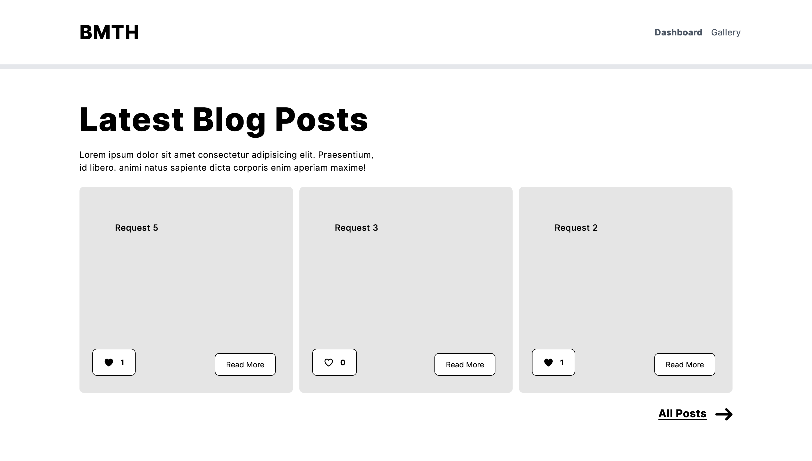
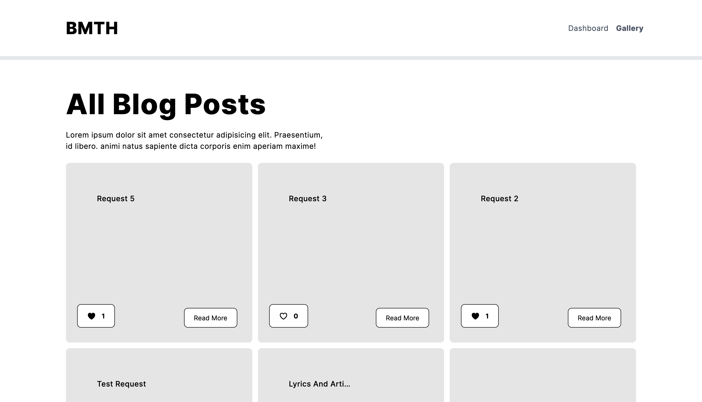
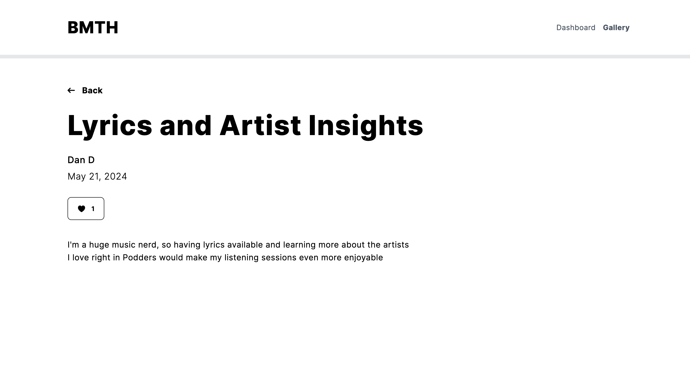

# Bettermode Take Home

This project is a web application created as part of the application process for the Senior Front-End Engineer position at Bettermode. The application showcases skills with modern web technologies including Vite, React, TypeScript, and Tailwind CSS. It features a paginated gallery of posts with detailed views and interactive elements, leveraging GraphQL for data fetching and mutations.


## Installation
To get a local copy up and running follow these simple steps.

### Prerequisites
Make sure you have the following installed:
- Node.js >= 18.x
- npm

### Installation Steps
1. Clone the repository
    ```bash
    git clone https://github.com/danditomaso/bettermode-take-home.git
    ```
2. Navigate to the project directory
    ```bash
    cd bettermode-take-home
    ```
3. Install the dependencies
    ```bash
    npm install
    ```
## Run Locally

After cloning the project in the previous step

To run the project locally, use the following command:
```bash
npm run dev
```

## Features

- Displays a paginated list of posts in a gallery format.
- Includes a "Show More" button to load additional posts.
- Allows users to click on a post to view its details on a separate page.
- Responsive design
- Minimalist UI aesthetics
- Integrates a "Like" button on both the gallery view and the detail page of each post, displaying the current number of likes and updating this count upon user interaction.
-  Utilizes React Router for navigation between the gallery and individual post details.
- Uses URQL as the GraphQL client, with data fetching performed client-side.

## Tech Stack

### Client
- Typescript 
- React 
- React Router/Remix 
- TailwindCSS 
- URQL 

### Server 
- Remix


## Screenshots








## Running Tests

To run tests, run the following command

```bash
  npm run test
```

To check coverage, run the following command

```bash
   npm run coverage
```

## Known Issues

The "Like" button may get out of sync with the post's liked status due to the component using a useEffect. The local state in the like button is a workaround that can be removed once optimistic caching of reaction status is added.

## Support

For support, please email dan.ditomaso@gmail.com

